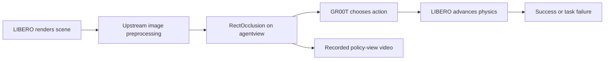

# Global Scene Occlusion Design

**Status:** accepted through the September 13 design discussion.

## Purpose

The first fault family tests how the GR00T policy responds when part of its
wide scene view is unavailable. LIBERO still simulates the same task, initial
state, robot, physics, wrist camera, and proprioceptive state. A deterministic
rectangle changes the `agentview` pixels immediately before the policy sees
them.

The first version answers a narrow question: can we describe, replay, and
later reduce a global visual condition that changes the task outcome?

## Integration point

The pinned evaluation harness at
`35f1200eb15608aa898f727a3722f7eef889c6cd` constructs the policy observation
in `LIBEROBenchmark.make_obs()`. It converts LIBERO's upright 256×256 RGB image
into `obs_dict["images"]["agentview"]`; wrist and state inputs are added
separately.

`DiagnosticLIBEROBenchmark` will subclass that implementation and override two
small methods:

- `make_obs()` calls the upstream method and transforms only the returned
  agent-view array.
- `_extract_frame()` applies the same transform to the frame sent to the
  upstream video recorder, so the saved video represents the image seen by the
  policy.

The project source is mounted read-only into the existing LIBERO container.
`PYTHONPATH` contains both the project source and the harness source, allowing
the YAML benchmark import to name
`robot_debug.libero:DiagnosticLIBEROBenchmark`. This keeps the pinned upstream
checkout and container image unchanged.

## Occlusion specification

`RectOcclusion` is an immutable value with these fields:

| Field | Meaning |
| --- | --- |
| `enabled` | Whether to apply the transform |
| `x`, `y` | Normalized top-left position in `[0, 1)` |
| `width`, `height` | Normalized positive extent |
| `color` | Three RGB integers in `[0, 255]` |
| `opacity` | Blend strength in `[0, 1]`; the first experiments use `1.0` |

The rectangle must stay fully inside the image. Normalized coordinates make a
case independent of image resolution. Pixel bounds use floor for the top-left
and ceiling for the bottom-right, ensuring that every valid nonzero rectangle
covers at least one pixel.

The transform accepts an H×W×3 `uint8` NumPy array and returns a new contiguous
array. A disabled or zero-opacity transform remains byte-equal to the input.
The input is never changed in place. Invalid coordinates, color, opacity,
shape, or data type fail before an episode starts.

## Data flow

The wrist image and robot state bypass the rectangle. The benchmark's task
instruction and success predicate continue through the upstream implementation.

## Configuration and records

The experiment YAML contains the complete rectangle under
`benchmarks[].params.agentview_occlusion`. The harness already stores benchmark
parameters in its SQLite metadata and aggregate JSON, which makes the
perturbation replayable without a second metadata channel.

The container configuration requires `ROBOT_DEBUG_SRC` on the host to point to
this repository's `src` directory. It mounts that directory at
`/workspace/robot-debug-src:ro` and sets
`PYTHONPATH=/workspace/robot-debug-src:/workspace/src`.

Each cloud run uses a distinct output directory and retains its aggregate JSON,
per-step JSONL, SQLite database, and policy-view video. Infrastructure errors
do not count as task failures.

## Initial experiment contract

The first cloud compatibility check uses one centered, opaque black rectangle
covering 6.25% of the image area (`width=0.25`, `height=0.25`). It repeats the
same task, episode index, and seeds as the successful nominal baseline. This
single case validates the adapter and recording path; it is not a robustness
measurement.

After reviewing that recording, a fixed sweep can vary rectangle position and
area up to 25% while preserving the same nominal controls. Candidate failures
are rerun five times before reduction. A case is valid only when a human can
confirm from the recorded policy-view video that the scene remains meaningfully
interpretable. Automated object visibility is outside this first version.

## Verification

Local unit tests cover:

- normalized coordinate validation and pixel-bound conversion;
- opaque and blended RGB output;
- byte-equal disabled behavior and input immutability;
- changing only `images.agentview` in a full observation;
- rejecting unsupported array shapes and data types;
- mapping YAML-compatible dictionaries into an immutable specification.

The cloud compatibility check then proves that the mounted subclass imports in
the pinned Python 3.8 container, produces a policy-view recording, and completes
one episode without changing the nominal task identity.

## Scope boundary

This increment implements one static agent-view rectangle and its container
integration. Blur, brightness, wrist dropout, camera pose changes, adaptive
search, failure reduction, and action/state trace enrichment remain separate
increments after the first transformed episode works.
